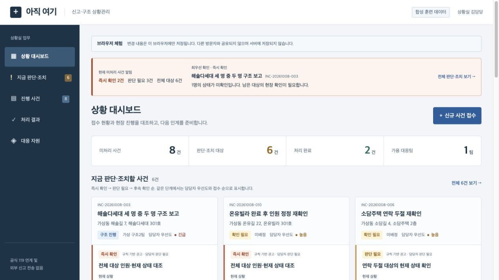

# 아직 여기

**신고가 폭주할 때, 아직 안전이 확인되지 않은 사람을 다음 확인·대응으로 연결하는 상황실 콘솔.**

집중호우로 고립된 주택·다세대 건물을 대상으로 한다. 소방청 다매체 신고의 공개 채널 구성을 참고해, 신고 원문과 현장 보고를 대조하고 인원·위치·연락·배정의 확인 과제를 보여준다. Track 1 **AI for Safety & Resilience** 해커톤 프로젝트다.

**[Netlify 체험 사이트](https://namojo-hack-test.netlify.app/)** · [GitHub 저장소](https://github.com/namojo/codexhack2026)

AI 심사는 [서비스·원문 안내](https://namojo-hack-test.netlify.app/judge/)와 [llms.txt](https://namojo-hack-test.netlify.app/llms.txt)에서 JavaScript 없이도 내용을 읽을 수 있다. [AI 연결과 검증](docs/ai-verification.md)에 현재 실행 상태를 정리한다. 이전 배포 기록은 [정적판 검증](docs/pages-verification.md)에 보존했다.

[저장소 관리](docs/repository-management.md) · [아이디어와 현재 기능](docs/project-overview.md) · [작업 과정과 결정](docs/development-log.md) · [배포와 저장 범위](docs/deployment.md) · [공개 근거](docs/sources.md)

## 무엇을 체험할 수 있나요?

- 대시보드와 모든 업무 메뉴에서 지금 판단·조치할 사건을 확인한다.
- 카드의 **현재 상황·왜 시급한가·원문 근거·다음 업무**를 따라 담당자가 판단한다.
- 사건을 접수하고 문자·음성·사진·앱·영상통화 모의 전사·인터넷 원문을 확인한다.
- 기존 사건에 추가 정보, 현장 보고, 인원·위치 정정을 등록한다.
- 가용팀을 배정하고 출동·현장 도착·구조 진행을 기록한다.
- 현재 인원과 같은 사건의 현장 근거를 대조해 처리 결과를 확정한다.
- 완료 후 새 정보가 오면 이전 결과와 원문을 보존하고 재확인한다.

카드·사건 행·배정된 자원은 넓은 영역에서 선택할 수 있다. 마우스 오버와 키보드 포커스를 표시하고 주요 버튼은 44px 클릭 영역을 갖춘다.



위 이미지는 실제 Netlify 공개판의 합성 사례 대시보드다. [접수 원문·보고 화면](docs/images/operator-console.jpg)과 [팀 배정 화면](docs/images/team-assignment.jpg)은 로컬 서버판 검증 증거로 보존했다.

## 공개판과 로컬 서버판

|항목|Netlify 공개 체험판|Codex CLI 로컬 시연|
|---|---|---|
|초기 데이터|합성 사건 10건·보고 20건·대응팀 4개|공개판과 같은 Supabase|
|사진·음성|생성 PNG 2장·한국어 TTS WAV 2개|같은 실제 첨부 파일|
|업무 상태 저장|Netlify API → Supabase 공용 합성 workspace|로컬 Node API → 같은 Supabase|
|실제 AI|기본 비활성; API 잔액·서버 설정 후 활성화|ChatGPT 로그인된 Codex CLI + 로컬 Whisper|
|접수·보고·배정·결과·정정|브라우저에서 체험|서버에 영속 저장|

모든 사례는 합성이다. 공식 119 접수·출동과 연결되지 않는다. 대시보드의 **규칙 기반 대조**와 **실제 AI 분석 초안**을 구분한다. 해커톤의 실제 분석은 로컬 Codex CLI가 기존 ChatGPT 로그인을 사용한다. 문자와 실제 PNG를 분석하고 WAV는 로컬 Whisper가 실제 전사한다. 별도 앱 OAuth를 구현한 것은 아니며, Netlify 서버는 CLI 로그인 토큰을 보관하지 않는다.

[Codex 시연 실행 안내](docs/codex-demo.md) · [현재 실제 검증](docs/ai-verification.md). OpenAI API도 충전 이후 문자·실제 사진·실제 WAV 전사의 세 사례가 모두 검증을 통과했다. 공개 활성화는 승인 대기이며, 서버 키·모델·활성 설정으로 전환한다. 충전 전 429와 최초 인용·근거 실패 기록도 보존했다. 생성 사진·TTS 음성은 실제 피해 자료가 아니며 seed의 대본과 실제 ASR 결과를 구분한다.

## 대표 사례와 지켜야 할 조건

|사례|확인하는 위험|
|---|---|
|같은 건물 201호·202호|다른 세대의 요청을 하나로 완료하지 않는다.|
|접수 3명·부분 구조 2명|남은 1명을 미확인으로 유지하며 전원 완료를 차단한다.|
|대리 신고자의 GPS|신고자 위치를 구조 대상 위치로 자동 덮어쓰지 않는다.|
|연락 두절|무응답을 안전 확인으로 취급하지 않는다.|
|완료 후 인원 정정|과거 결과를 보존하고 재개 후 새로운 현장 근거를 요구한다.|
|팀 배정·오래된 수정|다른 사건의 팀 중복 배정과 revision 충돌을 거절한다.|

[전체 재생 사례집](docs/casebook.md)과 [업무 흐름](docs/service-workflows.md)에 더 많은 사례가 있다.

## 실행하기

로컬 콘솔의 **건물 공간정보 목업** 메뉴에서는 [더포엠 역삼 3D 페이지](web/spatial/index.html)를 볼 수 있다. 공개 3~16층 평면도를 Sol로 해석하고, 같은 평면이 반복된다는 가정으로 건물 투시도를 만들었다. 층 선택·입체/평면 전환·합성 신고의 위치 후보·원본 근거를 확인한다. 1~2층 내부와 실제 층고·현장 상태는 미확인이다. 도면 재배포 조건을 확인하지 않아 Netlify 공개 빌드에는 포함하지 않는다. [공간정보 검증 기록](docs/spatial-verification.md).

ChatGPT 로그인된 Codex CLI 시연은 [시연 안내](docs/codex-demo.md)를 따른다. 아래 Python 서버는 AI 없이 기존 업무·재생을 확인하는 별도 SQLite 경로다. Python 3.11 이상이며 추가 패키지나 API 키 없이 실행한다.

```bash
python3 -B scripts/serve.py --port 8765
```

http://127.0.0.1:8765/ 에서 업무 콘솔을 연다. 첫 시작에 `data/seed.json`을 SQLite로 복사하며 이후 원문·변경·결과·감사 기록을 새로고침과 서버 재시작 뒤에도 보존한다. 기존 DB를 초기화하지 않는다.

정적 체험판 빌드:

```bash
python3 -B scripts/build_pages.py --output dist/pages
```

위 기본 빌드는 방문자별 오프라인 체험이다. 현재 Netlify 배포는 `--mode cloud`로 빌드하며 `netlify/functions/`를 함께 배포한다. [서버 설정과 SQL 설치](docs/ai-setup.md)를 따른다. 사용자 SQLite·업로드·환경 키·개발 재생기는 포함하지 않는다. `netlify.toml`에 빌드와 보안 헤더를 정의했다. [배포 안내](docs/deployment.md)를 참고한다.

## 검증하기

```bash
python3 -B -m unittest discover -s tests -v
python3 -B -m rescue.smoke
python3 -B scripts/replay.py --all
node tests/pages_qa.cjs
python3 -B .agents/skills/harness/scripts/validate.py --project .
```

기존 서버·UX 검증은 unittest 71개, 엔진 smoke 28개, fixture 20사례·91 assertions, 기존 JS/DOM 모의 15개와 메인의 실제 브라우저 검사로 이루어졌다. 정적 어댑터의 추가 검사와 실제 공개 배포 결과는 [배포 검증](docs/pages-verification.md)에 별도로 기록한다.

[서비스 검증](docs/service-verification.md) · [판단·조치 검증](docs/attention-verification.md) · [선택·버튼 UX 검증](docs/interaction-verification.md)

통과한 fixture는 AI 정확도·생존율·시간 절감의 증거가 아니다. 운영자 비교 실험, 실제 LLM·ASR 정확도, 현장 구조 성과와 공식 연계는 아직 검증하지 않았다. OpenAI API 성공 검사는 잔액 부족으로 미실행이며, Codex CLI 실제 실행은 별도 기록으로 구분한다.

## 실제 분석과 담당자 확인

신규 신고 또는 현장 메뉴에서 원문과 사진·음성을 입력하면 background 분석 작업이 생성된다. 사건은 자동 변경되지 않는다. 담당자가 119 접수 항목, 근거, 중복 후보·남은 인원·위치 출처·확인 질문을 수정하고 검토 사유와 확인을 등록해야 원문·분석·감사 이력이 함께 저장된다. 신고 진위와 동일인 여부를 자동 확정하지 않는다.

`scripts/analyzer_codex.mjs`는 ChatGPT 로그인된 CLI의 실제 문자·사진 분석과 로컬 Whisper 전사를 사용한다. `service/ai.py`와 `scripts/analyzer_openai.py --service`, Netlify 함수는 나중 사용할 OpenAI Responses·전사 API 경로다. 두 제공자는 같은 strict JSON 스키마와 Supabase 작업·담당자 확정 흐름을 사용한다. 공급된 TTS 대본을 ASR 결과로 사용하지 않는다.

|119 정보|저장 내용|
|---|---|
|접수|접수번호·수신·갱신·상태|
|신고자|표시 이름·회신 채널·연락처·관계|
|위치|주소·층·호수·접근·GPS·출처·미확인 상태|
|상황·구조 대상|원문·요약·재난 분류·시각·인원·부상·의식·호흡·고립|
|위험·첨부|신고 위험·사진 관찰·추가 확인·사진·음성·실제 전사|
|담당자 검토|누락·우선 검토 경고·확인·수정 이력|

[AI 계약](docs/ai-service-contract.md) · [연결](docs/ai-setup.md) · [심사 읽기 전략](docs/ai-judge-readiness.md) · [실제 검증](docs/ai-verification.md)

## 하네스와 AI 확장

`rescue/`, `scenarios/`, `scripts/replay.py`는 원문·상태·담당자 확인을 반복 검증하는 개발 도구다. 기본 업무 UI에서는 공개하지 않는다. 개발 재생기를 열려면 별도 포트에서 명시적으로 활성화한다.

```bash
python3 -B scripts/serve.py --port 8766 --dev-tools
```

분석기 계약은 **STDIN 원본 이벤트와 직전 상태 → STDOUT 분석 JSON**이다. live 모드는 정답 fixture, 기대값, 미래 이벤트를 모델에 보내지 않는다. 환경에 `OPENAI_API_KEY`와 `OPENAI_MODEL`이 설정된 경우 선택 어댑터를 사용할 수 있다. 키를 저장소에 넣지 않는다.

```bash
python3 -B scripts/replay.py --case same-building --mode live \
  --analyzer-command "python3 -B scripts/analyzer_openai.py"
```

[분석·상태 계약](docs/contract.md) · [서비스 계약](docs/service-contract.md) · [권고 계약](docs/attention-contract.md) · [아키텍처](docs/architecture.md) · [서비스 하네스](docs/service-harness.md)

역할과 스킬은 `.codex/agents/`, `.agents/skills/`에 있다. 제작자와 독립 QA를 분리하고 메인은 공통 계약·통합·브라우저 검증을 맡는다. 컴퓨터별 실행 장부와 임시 산출물은 공개하지 않으며 작업 과정과 실제 실행·재사용·미실행 범위는 문서에 요약했다.

## 문서 안내

- 현재 아이디어: [프로젝트 개요](docs/project-overview.md)
- 사용자 피드백과 수정 이유: [작업 과정](docs/development-log.md)
- 초기 인계 개념의 기록: [초기 제안서](docs/proposal.md)
- 합성 사례와 미디어 출처: [사례집](docs/casebook.md), [provenance](data/media/provenance.json)
- 공개 화면과 저장 범위: [Netlify 배포](docs/deployment.md)
- 배포 대상 변경: [최신 사용자 결정](docs/netlify-deployment-decision.md)
