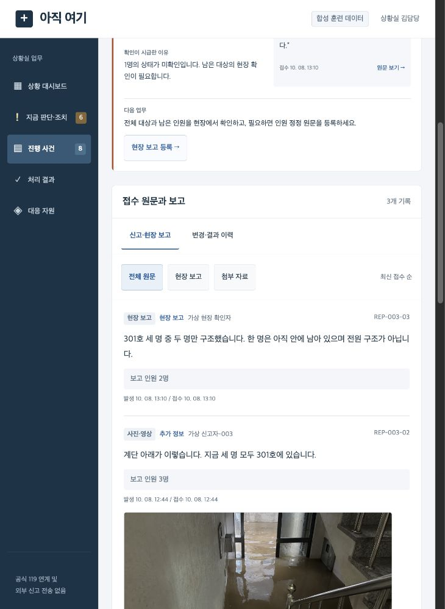

# 아직 여기

**신고가 폭주할 때, 아직 안전이 확인되지 않은 사람을 다음 확인·대응으로 연결하는 상황실 콘솔.**

집중호우로 고립된 주택·다세대 건물을 대상으로 한다. 소방청 다매체 신고의 공개 채널 구성을 참고해, 신고 원문과 현장 보고를 대조하고 인원·위치·연락·배정의 확인 과제를 보여준다. Track 1 **AI for Safety & Resilience** 해커톤 프로젝트다.

**[Netlify 체험 사이트](https://namojo-hack-test.netlify.app/)** · [GitHub 저장소](https://github.com/namojo/hack-test)

실제 주소와 배포·검증 기록은 [배포 검증](docs/pages-verification.md)에 정리했다.

[아이디어와 현재 기능](docs/project-overview.md) · [작업 과정과 결정](docs/development-log.md) · [배포와 저장 범위](docs/deployment.md) · [공개 근거](docs/sources.md)

## 무엇을 체험할 수 있나요?

- 대시보드와 모든 업무 메뉴에서 지금 판단·조치할 사건을 확인한다.
- 카드의 **현재 상황·왜 시급한가·원문 근거·다음 업무**를 따라 담당자가 판단한다.
- 사건을 접수하고 문자·음성·사진·앱·영상통화 모의 전사·인터넷 원문을 확인한다.
- 기존 사건에 추가 정보, 현장 보고, 인원·위치 정정을 등록한다.
- 가용팀을 배정하고 출동·현장 도착·구조 진행을 기록한다.
- 현재 인원과 같은 사건의 현장 근거를 대조해 처리 결과를 확정한다.
- 완료 후 새 정보가 오면 이전 결과와 원문을 보존하고 재확인한다.

카드·사건 행·배정된 자원은 넓은 영역에서 선택할 수 있다. 마우스 오버와 키보드 포커스를 표시하고 주요 버튼은 44px 클릭 영역을 갖춘다.



위 이미지는 로컬 서버판의 합성 사례 검증 화면이다. 공개판도 같은 업무 UI를 사용한다.

## 공개판과 로컬 서버판

|항목|Netlify 공개 체험판|로컬 서버판|
|---|---|---|
|초기 데이터|합성 사건 10건·보고 20건·대응팀 4개|같은 seed에서 시작|
|사진·음성|생성 PNG 2장·한국어 TTS WAV 2개|같은 실제 첨부 파일|
|업무 상태 저장|각 방문자 브라우저 localStorage|Python API와 SQLite|
|다른 방문자와 공유|공유되지 않음|이 로컬 서버의 DB 사용|
|접수·보고·배정·결과·정정|브라우저에서 체험|서버에 영속 저장|

모든 사례는 합성이다. 공식 119 접수·출동과 연결되지 않는다. 현재 권고는 **규칙 기반 대조**이며 실제 LLM 호출 결과가 아니다. 음성 전사문은 TTS 대본이고 영상통화 내용은 인간이 작성한 모의 전사다. 생성 사진은 실제 피해 사진이 아니다.

## 대표 사례와 지켜야 할 조건

|사례|확인하는 위험|
|---|---|
|같은 건물 201호·202호|다른 세대의 요청을 하나로 완료하지 않는다.|
|접수 3명·부분 구조 2명|남은 1명을 미확인으로 유지하며 전원 완료를 차단한다.|
|대리 신고자의 GPS|신고자 위치를 구조 대상 위치로 자동 덮어쓰지 않는다.|
|연락 두절|무응답을 안전 확인으로 취급하지 않는다.|
|완료 후 인원 정정|과거 결과를 보존하고 재개 후 새로운 현장 근거를 요구한다.|
|팀 배정·오래된 수정|다른 사건의 팀 중복 배정과 revision 충돌을 거절한다.|

[전체 재생 사례집](docs/casebook.md)과 [업무 흐름](docs/service-workflows.md)에 더 많은 사례가 있다.

## 실행하기

Python 3.11 이상. 로컬 서버판은 추가 패키지나 API 키 없이 실행한다.

```bash
python3 -B scripts/serve.py --port 8765
```

http://127.0.0.1:8765/ 에서 업무 콘솔을 연다. 첫 시작에 `data/seed.json`을 SQLite로 복사하며 이후 원문·변경·결과·감사 기록을 새로고침과 서버 재시작 뒤에도 보존한다. 기존 DB를 초기화하지 않는다.

정적 체험판 빌드:

```bash
python3 -B scripts/build_pages.py --output dist/pages
```

Netlify에는 이 출력 폴더만 배포한다. 사용자 SQLite·업로드·환경 키·개발 재생기는 포함하지 않는다. `netlify.toml`에 빌드와 보안 헤더를 정의했다. [배포 안내](docs/deployment.md)를 참고한다.

## 검증하기

```bash
python3 -B -m unittest discover -s tests -v
python3 -B -m rescue.smoke
python3 -B scripts/replay.py --all
node tests/pages_qa.cjs
python3 -B .agents/skills/harness/scripts/validate.py --project .
```

기존 서버·UX 검증은 unittest 71개, 엔진 smoke 28개, fixture 20사례·91 assertions, 기존 JS/DOM 모의 15개와 메인의 실제 브라우저 검사로 이루어졌다. 정적 어댑터의 추가 검사와 실제 공개 배포 결과는 [배포 검증](docs/pages-verification.md)에 별도로 기록한다.

[서비스 검증](docs/service-verification.md) · [판단·조치 검증](docs/attention-verification.md) · [선택·버튼 UX 검증](docs/interaction-verification.md)

통과한 fixture는 AI 정확도·생존율·시간 절감의 증거가 아니다. 운영자 비교 실험, 실제 LLM/OCR/ASR 성능, 현장 구조 성과와 공식 연계는 아직 측정·구현하지 않았다.

## 하네스와 AI 확장

`rescue/`, `scenarios/`, `scripts/replay.py`는 원문·상태·담당자 확인을 반복 검증하는 개발 도구다. 기본 업무 UI에서는 공개하지 않는다. 개발 재생기를 열려면 별도 포트에서 명시적으로 활성화한다.

```bash
python3 -B scripts/serve.py --port 8766 --dev-tools
```

분석기 계약은 **STDIN 원본 이벤트와 직전 상태 → STDOUT 분석 JSON**이다. live 모드는 정답 fixture, 기대값, 미래 이벤트를 모델에 보내지 않는다. 환경에 `OPENAI_API_KEY`와 `OPENAI_MODEL`이 설정된 경우 선택 어댑터를 사용할 수 있다. 키를 저장소에 넣지 않는다.

```bash
python3 -B scripts/replay.py --case same-building --mode live \
  --analyzer-command "python3 -B scripts/analyzer_openai.py"
```

[분석·상태 계약](docs/contract.md) · [서비스 계약](docs/service-contract.md) · [권고 계약](docs/attention-contract.md) · [아키텍처](docs/architecture.md) · [서비스 하네스](docs/service-harness.md)

역할과 스킬은 `.codex/agents/`, `.agents/skills/`에 있다. 제작자와 독립 QA를 분리하고 메인은 공통 계약·통합·브라우저 검증을 맡는다. 컴퓨터별 실행 장부와 임시 산출물은 공개하지 않으며 작업 과정과 실제 실행·재사용·미실행 범위는 문서에 요약했다.

## 문서 안내

- 현재 아이디어: [프로젝트 개요](docs/project-overview.md)
- 사용자 피드백과 수정 이유: [작업 과정](docs/development-log.md)
- 초기 인계 개념의 기록: [초기 제안서](docs/proposal.md)
- 합성 사례와 미디어 출처: [사례집](docs/casebook.md), [provenance](data/media/provenance.json)
- 공개 화면과 저장 범위: [Netlify 배포](docs/deployment.md)
- 배포 대상 변경: [최신 사용자 결정](docs/netlify-deployment-decision.md)
