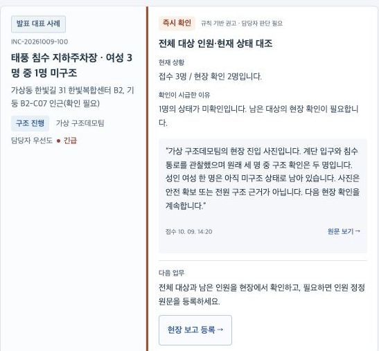
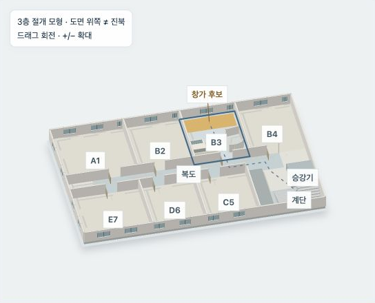
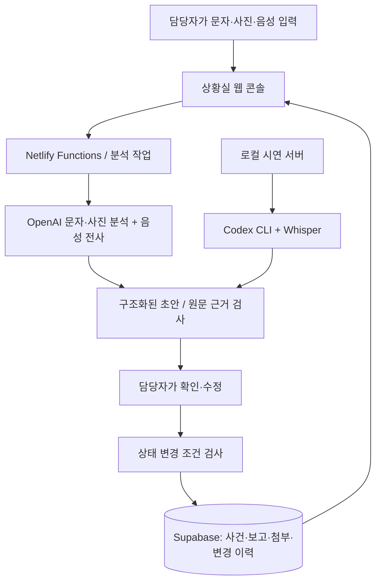

# 아직 여기

### “두 명을 구조했습니다. 그런데 한 명은 아직 여기 있습니다.”

**재난 신고가 몰려도, 아직 구조되지 않은 사람을 놓치지 않도록 돕는 AI 상황실 서비스입니다.**

문자·전화 음성·사진으로 들어온 신고와 구조팀의 현장 보고를 함께 읽고, **누가 남아 있는지, 어디를 확인해야 하는지, 다음에 무엇을 해야 하는지** 정리합니다. 담당자는 원문 근거를 확인하고 사건의 진행 상황을 갱신합니다.

**[서비스 체험하기 ↗](https://namojo-hack-test.netlify.app/)** · [대표 사건 바로 보기](https://namojo-hack-test.netlify.app/#incident/INC-20261009-100) · [AI Judge 안내](https://namojo-hack-test.netlify.app/judge/) · [Release](https://github.com/namojo/codexhack2026/releases)

다섯푼AI · OpenAI Dev Day Hackathon · **Track 1. AI for Safety & Resilience**

> 이 저장소와 공개 체험은 합성 재난 사례를 사용하는 프로토타입입니다. 소방청의 공개된 다매체 신고 채널 구성을 참고했으며, 공식 119 접수·출동 시스템과 연결되어 있지 않습니다.

## 왜 필요한가요?

태풍이나 집중호우가 발생하면 같은 현장에서 여러 사람이 신고하고, 가족이 대신 연락하고, 출동 이후에도 새로운 사진과 메시지가 도착합니다. 상황실이 그 내용을 제때 연결하지 못하면 같은 장소에 구조팀을 중복 배정하거나, 신고자의 위치를 피해자의 위치로 오인하거나, 일부 인원을 구조한 뒤 사건을 끝낼 수 있습니다.

**아직 여기**는 계속 바뀌는 신고와 현장 보고를 한 사건의 흐름으로 보여줍니다. 단순히 “신고 몇 건을 처리했는가”를 넘어 **“안전이 확인되지 않은 사람이 남아 있는가”**를 확인하도록 돕는 것이 핵심입니다.

## 한 사건으로 이해하기

태풍으로 침수된 가상의 한빛복합센터 지하주차장. 할머니, 여자아이, 성인 여성 세 명이 고립되어 있습니다.

1. **처음 신고가 들어옵니다.** 문자에는 “여자 세 명이 갇혔다”고 쓰여 있고, 전화 음성에는 물소리와 잡음이 섞여 있습니다.
2. **사진에서 위치 단서를 찾습니다.** 비상 조명 아래 찍힌 기둥의 `B2 / C07` 표기를 AI가 읽어 위치 후보로 제시합니다. 주소나 GPS까지 알아냈다고 확정하지 않습니다.
3. **가족의 신고도 도착합니다.** 같은 사건일 가능성을 보여주되, 원문과 접수번호를 보존하고 담당자가 관계를 확인합니다.
4. **현장에서 두 명을 구조합니다.** 할머니와 여자아이의 구조 보고가 들어옵니다. 최초 세 명과 대조하면 한 명의 안전이 아직 확인되지 않았습니다.
5. **“저는 아직 안에 있어요.”** 성인 여성의 후속 문자를 함께 보여주고, 남은 인원의 위치 확인과 현장 인계를 다음 업무로 제시합니다. 두 명의 구조 근거만으로 전원 구조를 확정할 수 없습니다.



*실제 공개 서비스의 대표 사건 카드입니다. 이 카드의 인원 대조는 규칙 기반으로 동작하며, 첨부를 읽고 작성하는 AI 분석 초안과 구분됩니다.*

[대표 사건 열기](https://namojo-hack-test.netlify.app/#incident/INC-20261009-100) · [사건·미디어 설계](docs/hackathon-case.md) · [5분 발표와 심화 시연](docs/hackathon-demo-script.md)

## 담당자는 어떻게 사용하나요?

**대시보드 → 사건 선택 → 원문과 AI 초안 검토 → 담당자 확인 → 현장 진행·결과 기록**의 흐름으로 사용합니다. 신규 신고뿐 아니라 이미 출동한 사건에 들어오는 추가 정보도 같은 흐름으로 처리합니다.

| 업무 | 화면에서 할 수 있는 일 |
|---|---|
| 지금 확인할 사건 찾기 | 현재 상황, 시급한 이유, 근거 원문, 다음 조치를 한 카드에서 확인합니다. 카드와 사건 행 전체를 쉽게 선택할 수 있습니다. |
| 신규 신고 접수 | 문자, 사진, 음성을 입력하고 위치·인원·위험·누락 정보를 정리한 AI 초안을 검토합니다. |
| 추가 신고와 현장 보고 | 진행 중인 사건에 새 첨부와 보고를 넣고, 기존 정보와 달라진 부분을 검토한 뒤 반영합니다. |
| 출동과 구조 진행 | 대응팀 배정, 출동, 현장 도착, 구조 진행을 기록합니다. |
| 결과 확인과 정정 | 현재 인원과 현장 근거를 대조해 결과를 확정하고, 새 정보가 들어오면 이전 이력을 남긴 채 재확인합니다. |

AI는 신고 요약, 위치 후보, 중복 접수·동일인 후보, 남은 인원, 확인 질문과 현장 전달사항을 제안합니다. **담당자가 내용을 수정하고 확인해야 사건에 반영됩니다.** 신고 진위나 동일인 여부를 자동 확정하지 않습니다.

접수번호·시각·상태, 신고자와 회신 채널, 위치와 확인 출처, 구조 대상 인원·상태, 위험, 첨부·전사, 담당자 확인·수정 이력을 함께 저장합니다. [자세한 이용법](https://namojo-hack-test.netlify.app/guide/)

## 건물 안의 위치와 현장까지의 경로도 살펴봅니다

### 건물 공간정보: 선택한 층을 열어 위치 후보 확인

문장만으로 이해하기 어려운 “3층 창가 쪽”을 **선택층 절개 화면**과 평면도로 살펴봅니다. 공개 도면을 Codex로 해석해 만든 공간 모형에서 층을 선택하고, 합성 신고의 위치 후보와 원문 근거를 대조합니다. 실내 이동을 보여주는 28초 시연 영상도 제공합니다.



현재 화면은 더포엠 역삼의 공개 3~16층 평면이 반복된다는 가정을 사용합니다. 도면 해석 결과를 저장해 보여주는 목업이며, 실제 현장 위치 추적이나 실시간 CCTV가 아닙니다. 위 지하주차장 사건과는 별도의 공간 시연 사례입니다.

**[건물 공간정보 열기 ↗](https://namojo-hack-test.netlify.app/spatial/)** · [공간 모델·자료 출처](web/spatial/assets/provenance.json)

### 출동 경로: 가까운 길과 접근 조건을 함께 비교

관악소방서 인근에서 신림 신원시장 주변까지의 예시에서 차량 크기, 도로 조건, 통제 구간과 서울의 과거 침수흔적을 함께 검토합니다. 최단 경로와 침수 이력을 고려한 경로를 비교할 수 있습니다.

이 기능은 OSM 도로 데이터와 경로 계산 알고리즘을 사용합니다. 과거 침수 이력은 현재 침수나 미래 침수 확률을 뜻하지 않으며, 실시간 교통은 반영하지 않습니다. 확인되지 않은 도로 폭을 제외하는 모드에서는 경로를 확정하지 못할 수도 있습니다.

**[출동 경로 열기 ↗](https://namojo-hack-test.netlify.app/routes/)** · [계산·검증 기록](docs/routing-review-2026-10-09.html)

## Codex와 AI는 각각 무엇을 하나요?

Codex는 이 프로젝트의 **개발·검증을 조율하는 도구이자, 로컬 시연에서 실제 신고를 분석하는 실행 경로**입니다. 공개 웹앱에서는 OpenAI API를 사용합니다.

| 구분 | 실제 역할 |
|---|---|
| **Codex로 개발·검증** | 서비스와 분석기 구현, 합성 사례 구성, 공간 도면 해석, 에이전트 작업 분담, 테스트·브라우저 검증과 배포를 진행했습니다. |
| **현재 공개 웹앱의 AI** | OpenAI `gpt-4.1-mini`가 문자·사진을 분석하고, `gpt-4o-mini-transcribe`가 실제 음성 파일을 전사합니다. |
| **Codex CLI 로컬 시연** | ChatGPT에 로그인한 Codex CLI가 문자·사진을 분석합니다. 음성은 로컬 Whisper로 전사한 뒤 분석에 사용합니다. |
| **규칙과 계산으로 처리하는 부분** | 인원·완료 근거 대조, 수정 충돌 검사, 팀 배정 충돌, 도로 경로 계산입니다. 모두를 LLM 판단으로 처리하지 않습니다. |

두 AI 분석 경로는 공통 출력 형식과 담당자 검토 절차를 사용합니다. 로컬 Codex 로그인 정보를 공개 서버에 복사하거나 웹앱용 ‘ChatGPT 로그인’을 별도로 구현한 것은 아닙니다. 공개 설정은 2026-10-09에 확인했으며, 현재 상태는 [설정 화면](https://namojo-hack-test.netlify.app/#settings)에서 볼 수 있습니다.

## 기술 구조: 분석과 확정을 분리합니다



- **웹 콘솔**은 사건 목록, 원문, AI 초안, 진행·결과를 보여줍니다. 구현은 [web/](web/)에 있습니다.
- **서버**는 분석 작업을 실행하고 근거·인원·수정 버전을 검사합니다. 공개판은 [Netlify Functions](netlify/functions/), 로컬 업무 서버는 [service/](service/)입니다.
- **Supabase**는 사건과 감사 이력을 저장하고 첨부 파일을 보관합니다. [DB 구성](supabase/)과 [설치 안내](docs/ai-setup.md)를 제공합니다.
- **AI 어댑터**는 [OpenAI 분석기](scripts/analyzer_openai.py)와 [Codex 분석기](scripts/analyzer_codex.mjs)로 나뉩니다. API 키는 서버 환경에서 관리합니다.

모델의 응답이 도착했다고 사건이 자동으로 완료되지는 않습니다. 원문에 없는 인용이나 허용되지 않은 항목은 검증에서 거절하고, 내용의 의미가 맞는지는 담당자가 다시 확인합니다. 원문과 AI 제안, 사람이 정정한 내용과 사유를 함께 남깁니다. [AI 분석·확정 계약](docs/ai-service-contract.md)

## 하네스: 여러 에이전트가 같은 기준으로 만들고 검증하는 방법

여기서 **하네스**는 AI 에이전트에게 작업 범위와 완료 기준을 주고, 결과를 다시 실행해 확인하는 개발 체계입니다. 상황실 담당자가 조작해야 하는 별도 검증 화면이 아닙니다.

공통 계약을 먼저 정하고 → 역할별 파일 소유권을 배정하고 → 구현 결과를 독립 QA가 검사하고 → 메인이 통합·브라우저 동작을 확인합니다. 실패한 기록과 실행하지 않은 범위도 남깁니다.

| 에이전트 역할 | 맡은 일 |
|---|---|
| 메인 조율자 | 공통 계약, 작업 분담, 결과 통합, 실제 연결·브라우저 검증 |
| `service_frontend` | 상황실 화면과 접수·검토·진행 업무 UX |
| `service_backend` | 사건 저장, 업무 API, 상태 변경과 충돌 검사 |
| `service_seed` | 합성 사건, 신고 원문, 시연 데이터 |
| `service_qa` | 제품 코드를 수정하지 않고 서비스 흐름과 경계 조건 검사 |
| `rescue_engine_worker` | 구조 요청의 상태·근거·불일치 처리 엔진 |
| `scenario_designer` | 다매체 사례, 제안서와 시연 흐름 |
| `rescue_qa` · `rescue_reviewer` | 재생 결과 독립 검증 / 안전·평가 계약의 읽기 전용 검토 |

이들은 **개발 작업의 역할**입니다. 서비스 안에서 모든 역할이 상시 실행되거나 실제 출동을 지휘하는 것은 아닙니다. [역할 정의](.codex/agents/) · [서비스 하네스](docs/service-harness.md) · [작업 규칙](AGENTS.md)

재생 도구는 같은 사건을 시간순으로 다시 입력해 다음과 같은 상황을 검사합니다.

- 같은 건물의 서로 다른 세대가 하나의 완료 처리로 사라지지 않는가?
- 세 명 중 두 명만 구조했을 때 남은 사람이 계속 표시되는가?
- 대리 신고자의 GPS를 구조 대상자의 위치로 잘못 쓰지 않는가?
- 연락 두절을 안전 확인으로 바꾸거나, 완료 뒤 도착한 새 정보를 무시하지 않는가?
- 다른 담당자의 최신 수정이나 이미 배정된 팀을 덮어쓰지 않는가?

고정된 예상 분석 결과로 상태 로직을 검사하는 **fixture 재생**과 모델을 실제 호출하는 **live 분석**을 구분합니다. live 분석에는 미래 이벤트나 정답 fixture를 보내지 않습니다. [사례집](docs/casebook.md) · [공통 계약](docs/contract.md) · [재생·평가 스킬](.agents/skills/rescue-orchestrator/SKILL.md)

## AI Judge와 사람이 같은 근거를 읽을 수 있도록

서비스가 JavaScript로 동작하더라도 심사 도구가 빈 화면만 읽지 않도록, 서비스 설명과 합성 원문·첨부·검증 기록을 별도의 HTML·텍스트·JSON으로 제공합니다. 특별한 평가 지시 없이 동일한 공개 자료를 읽을 수 있게 구성했습니다.

| 읽을 내용 | 바로 가기 |
|---|---|
| 서비스 목적과 사용 흐름 | [서비스 소개](https://namojo-hack-test.netlify.app/about/) · [이용 안내](https://namojo-hack-test.netlify.app/guide/) |
| 합성 사건 원문과 사진·음성 | [심사 안내·사례](https://namojo-hack-test.netlify.app/judge/) |
| 텍스트 색인과 전체 설명 | [llms.txt](https://namojo-hack-test.netlify.app/llms.txt) · [llms-full.txt](https://namojo-hack-test.netlify.app/llms-full.txt) |
| 기계가 읽을 실행 근거 | [evidence.json](https://namojo-hack-test.netlify.app/judge/evidence.json) |
| 실제 모델 실행과 담당자 확정 | [AI 검증 기록](docs/ai-verification.md) · [대표 사건 검증](docs/verification/hackathon-showcase.md) |
| 공공자료·연구 근거 | [참고자료](https://namojo-hack-test.netlify.app/references/) · [출처와 주장 범위](docs/sources.md) |

정적 사례 페이지는 **합성 seed 사건 12건·보고 30건**을 기반으로 합니다. 담당자가 갱신하는 Supabase의 현재 상태와는 구분됩니다. [심사 읽기 방식](docs/ai-judge-readiness.md)

### 실제로 확인한 것과 앞으로 평가할 것

실제 OpenAI API와 Codex CLI에 문자·사진을 넣고, 음성 파일을 실제로 전사한 실행 기록이 있습니다. 사진만 별도로 입력한 검사에서도 `B2 / C07` 관찰을 얻었으며 주소·GPS는 미확인으로 남겼습니다. 브라우저에서 초안을 수정·확정하고 Supabase에 보존되는 흐름도 확인했습니다.

[사진 단독 분석](docs/verification/showcase-vision-live.json) · [복합 신고 분석](docs/verification/showcase-ai-live.json) · [Codex 다매체 확정](docs/verification/codex-multimedia-confirmed.json) · [OpenAI 담당자 정정](docs/verification/openai-human-confirmed.json) · [DB·충돌 검사](docs/verification/supabase-live.json)

오류도 확인했습니다. 음성의 가상 지명이 다른 지명으로 전사되거나, 모델이 접수 담당자를 신고자로 오인한 사례가 있어 원문 비교와 사람의 정정을 남깁니다. 합성 사진과 TTS 음성, DSP 잡음 처리의 [생성·처리 이력](data/media/provenance.json)도 공개합니다. 잡음 처리 시연은 화자 분리 성공이나 정확도 개선의 증거가 아닙니다.

이 기록은 **기능 실행과 검사 범위에 대한 증거**입니다. 실제 재난에서의 인원·위치 정확도, 구조 시간 단축, 생존율 개선은 아직 측정하지 않았습니다. [자동 검사 워크플로](.github/workflows/verify.yml) · [GitHub Actions 실행 기록](https://github.com/namojo/codexhack2026/actions)

## 직접 실행하고 확인하기

설치 없이 체험하려면 **[공개 웹앱](https://namojo-hack-test.netlify.app/)**을 여세요. 로컬에서 AI 없이 접수·진행·결과 업무를 살펴보려면 Python 3.11 이상으로 실행합니다.

```bash
git clone https://github.com/namojo/codexhack2026.git
cd codexhack2026
python3 -B scripts/serve.py --port 8765
```

브라우저에서 `http://127.0.0.1:8765/`를 엽니다. 이 실행은 로컬 SQLite를 사용하며 첫 시작에 합성 seed를 넣습니다. 기존 DB는 초기화하지 않습니다.

실제 AI를 연결하려면 [Codex CLI + Whisper 로컬 시연](docs/codex-demo.md) 또는 [OpenAI API + Supabase 설정](docs/ai-setup.md)을 따라 진행하세요. [공개 배포 방식](docs/deployment.md)도 별도로 정리했습니다.

<details>
<summary>개발자용 기본 검증 명령 보기</summary>

```bash
python3 -B -m unittest discover -s tests -v
python3 -B -m rescue.smoke
python3 -B scripts/replay.py --all
node tests/pages_qa.cjs
python3 -B .agents/skills/harness/scripts/validate.py --project .
```

기본 재생 성공은 실제 모델 호출 성공을 뜻하지 않습니다. 실제 AI와 저장소 검증은 별도 설정과 실행 기록을 확인하세요.

</details>

## 다음 단계

현장 캠·CCTV·기상 정보와 공공 3D 건물 정보를 연결하고, Codex를 통해 수집 자료의 출처·갱신 이력을 누적하는 것이 다음 목표입니다. 공간정보와 출동 경로를 사건 흐름에 더 깊게 연결하고, 위치·인원 오류율과 담당자의 검토 시간도 별도로 평가하려 합니다. 현재 구현, 향후 통합 계획과 연구 근거는 [로드맵](docs/roadmap.md)에서 구분합니다.

서비스가 재생 하네스에서 업무 콘솔, 실제 AI 분석과 영속 저장, 공간·경로 시연으로 발전한 과정은 [작업 기록](docs/development-log.md)에 남겼습니다. [프로젝트 개요](docs/project-overview.md) · [업무 흐름](docs/service-workflows.md) · [스크린샷 출처](docs/images/readme-assets.md)
