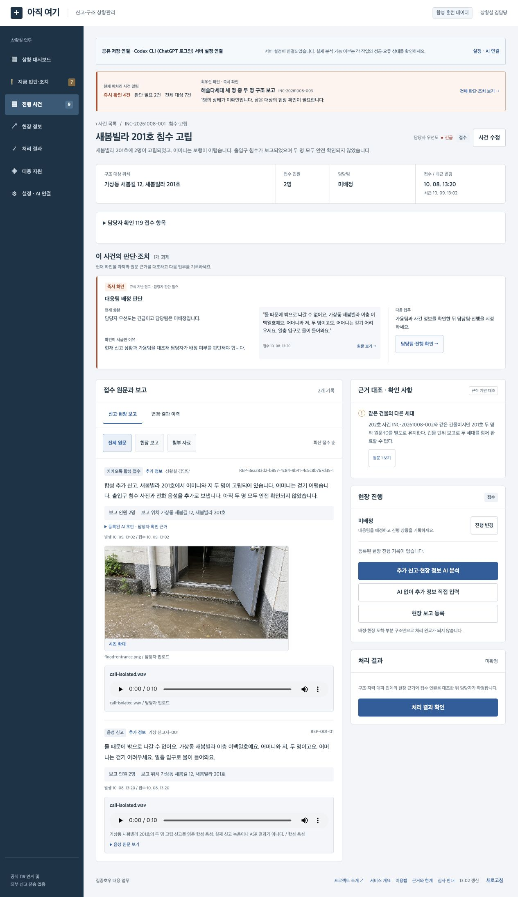

# 실제 AI·저장·심사 읽기 검증 — 2026-10-09

모의 검사는 통합 경계를 검증하며 실제 모델 정확도를 증명하지 않는다. 실제 실행은 [구조화 기록](verification/ai-live.json)과 아래 개별 기록에서 확인한다. 모든 입력은 합성이다.

## 실제 Codex CLI·Whisper

CLI 0.162.0의 `Logged in using ChatGPT`를 확인했다. 현재 사용자의 모델 설정을 상속했으며 모델 ID가 응답에 노출되지 않아 추정하지 않았다. 읽기 전용 sandbox, 격리 임시 cwd, STDIN 원문, strict JSON schema, 실제 이미지 파일을 사용했다. 로그인 토큰을 앱이 읽거나 클라우드에 복사하지 않았다.

|실제 입력|결과|증거|
|---|---|---|
|301호 3명 중 2명 구조, 1명 남음 문자|미확인 1명, 302호 전달 정정, 중복 후보와 인계 제안; 검증 통과|[첫 텍스트](verification/codex-text-live.json), [통합 작업](verification/codex-three-first.json)|
|실제 생성 PNG 출입구 침수|출입구·계단 침수 관찰, 주소·인원 미확인 구분; 검증 통과|[사진 분석](verification/codex-three-first.json)|
|카카오톡 합성 문자 + 실제 PNG + WAV 업로드|실제 Whisper small 전사 → Codex 분석 → 담당자 위치·사유 수정 → Supabase 확정|[실제 확정](verification/codex-multimedia-confirmed.json)|
|음성 단독 첫 분석|실제 전사 후 모델 인용이 원문과 달라 서버가 거절|[실패 보존](verification/codex-three-first.json)|

Whisper base/small을 프로젝트 전용 가상환경에 설치하고 실제 WAV를 전사했다. [small 전사](verification/whisper-small-live.json)는 “새봄”을 “세봄”으로 인식했다. 원문 전사를 고치지 않고 명칭 확인 과제로 유지했다. 첫 모델 다운로드를 포함한 시간을 순수 분석 시간으로 제시하지 않는다.

실제 브라우저에서 PNG/WAV 파일 선택·업로드, 초안과 출처 검토, 119 위치 수정, 확인 사유·체크박스·확정 등록, 사진 확대를 실행했다. 업로드된 WAV는 10.718277초이고 HTML audio readyState=4에서 실제 재생 후 ended=true를 확인했다. 파일 선택 자동화에 오래 걸린 시간은 모델 실행 시간과 구분한다.

## 실제 Supabase

SQL editor에서 마이그레이션을 적용하고 `rescue_workspace`, 분석 작업 RPC, 비공개 Storage 버킷을 설치했다. 실제 파일 저장과 프록시 반환 SHA가 일치했다. [영속·경합·완료 차단 기록](verification/supabase-live.json)은 새 신고/추가 보고 보존, 오래된 revision의 409와 남은 사람이 있는 동일 숫자 완료 시도 거절을 기록한다.

브라우저에서 확정한 `INC-20261008-001`은 revision 2, 추가 보고 1개, 담당자 수정 119 위치·사유·AI 분석·실제 전사·실행 ID·감사 이력을 보존했다. 같은 분석 작업의 확인을 다시 요청해도 HTTP200이며 보고 수가 늘지 않았다. AI 분석만으로 사건을 완료시키지 않았다. 기존 사용자 SQLite를 수정하거나 초기화하지 않았다.

## OpenAI API

충전 전 실제 요청은 HTTP429 `credit_balance_exhausted`였다. [실측 오류](verification/openai-credit-failure.json)를 보존한다. 사용자 충전 이후 세 실제 모델 응답은 도착했지만 필드 근거 누락·다른 인용 때문에 strict 검증에 실패했다. [충전 직후 결과](verification/openai-funded-first.json)를 보존하며 성공으로 표시하지 않는다. 동일 원문·실제 사진·실제 전사와 허용 출처를 명시하고 최대 한 번 재생성하도록 구현했다. [최신 실제 실행](verification/openai-funded-passed.json)은 문자·사진·음성 모두 검증 통과이며 gpt-4.1-mini, 실제 전사 gpt-4o-mini-transcribe, Responses ID와 usage를 남겼다. 세 최신 사례는 강화된 첫 입력에서 통과하여 실제 재생성은 0회다. 재생성 동작 자체는 독립 모의 검사와 구분한다.

실제 OpenAI 브라우저 초안을 검토·확정한 뒤 새로고침과 API 조회에서 보존을 확인했다. 모델이 접수 담당자 actor를 신고자 이름으로 오인한 실제 오류는 담당자가 119 이름·연락처·관계를 미확인 null로 정정했다. AI 원본과 정정 사유·감사 기록을 보존했다. 이전 Codex 초안은 새 보고 이후 확정 요청에 HTTP409를 반환했다. [담당자 확정·정정·오래된 초안](verification/openai-human-confirmed.json)을 참고한다.

## 독립 검사와 공개 읽기

제작자 검사와 독립 QA를 분리했다. 앞선 독립 QA가 발견한 NaN GPS와 JSONB 키 재정렬 hash 오류를 수정하고 v7의 고정 입력으로 재검증했다. Python 93, AI API 37, Codex·설정·보안 23, 저장 어댑터 21, 엔진 smoke 28, fixture 20사례·91단언을 모두 통과했다. 제품·의존성 지문 60개 일치와 하네스 완료 검사도 통과했다. 독립 QA의 실제 모델·DB·브라우저 재실행은 미실행이며, 메인의 실제 실행 증거를 별도로 검토했다. 설정 직접 진입 뒤 사건이 빈 목록으로 보이는 실제 브라우저 오류도 수정했다. 이전 실패 산출물은 새 성공으로 덮어쓰지 않는다.

공개 `/about/`, `/guide/`, `/references/`, `/judge/`, `llms.txt`, `llms-full.txt`는 JavaScript 없이 서비스 역할, 119 저장 항목, 12건·30보고의 합성 원문과 실제 미디어, 실제 실행과 한계를 읽게 한다. 현재 DB와 고정 seed 원문은 구분한다. `/judge/evidence.json`과 GitHub의 실행 기록을 연결한다.

인원·위치 정확도, ASR 오류율, 검토 시간 감소, 구조 성과와 공식 119 연계는 아직 평가하지 않았다.

공간정보 공개 통합 후 독립 회귀는 Python101(공간8 추가), AI API37, Codex23, 저장21 전부 통과했다. 최초 GitHub CI의 로컬 디렉터리명 단언 실패는 공백 없는 체크아웃에서 재현한 후 경로 기준을 수정했다. 제품이 아닌 검사 이식성 수정이며 공백 경로 실제 파일 읽기 검사를 함께 유지했다.
