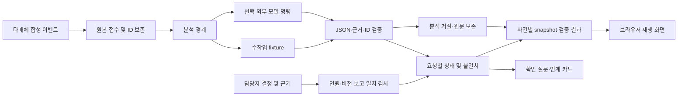

# 아키텍처

## 사용자와 판단 연결
상황실 담당자는 개별 요청과 현장 보고가 일치하는지 확인한다. 현장 구조팀은 대상 요청과 인원·결과를 보고한다. 하네스는 확인할 항목을 제시하고 담당자가 남긴 근거 있는 완료·인계만 반영한다. 자동 배정·구조 순위·의료 처치 지시를 만들지 않는다.

## 공개 채널을 모의 입력으로 옮기는 방법

| 공개 채널 | 이 하네스의 입력 | 보존 정보 | 해커톤 재현 범위 |
|---|---|---|---|
| SMS | sms.text | 신고 원문·발생/수신 시각·요청 ID | 합성 문자 분석 결과와 상태 재생 |
| MMS 사진·영상 | mms.attachments | 첨부 ID·촬영시각·판독 가능 여부·설명 | 인간작성 설명·모의 전사; OCR/영상분석 없음 |
| 앱 GPS | app.location | 좌표·오차·수집시각·위치의 대상 | 신고자/구조대상 구분, 좌표를 생성하지 않음 |
| 영상통화 | video_call.text/attachments | 모의 전사·관찰 기록·작성 출처 | 통화 시스템·수어인식·ASR 없음 |
| 인터넷 신고 | web.text | 원문·접수 ID | 인터넷 신고 형태를 모의 이벤트로 변환 |

실제 채널 연동 어댑터의 인증·payload·권한은 확인하지 않았다. 공개 홍보자료는 내부 API 스키마의 근거로 쓰지 않는다. [출처와 주장 범위](sources.md)를 따른다.

## 식별·시간·완료 원칙

접수 ID는 AI가 발명하는 사람이 아니라 원본 요청을 식별한다. 같은 건물로 그룹화해도 요청 카드와 근거를 제거하지 않는다. 동일 요청 확인은 연결 관계로 보존한다. 개별 사람을 식별할 정보가 없으면 인원을 특정 인물과 자동 대응시키지 않는다.

received_at은 처리순서, occurred_at은 진술 시각이다. 늦게 도착한 과거 위치가 새 위치를 덮지 않도록 한다. 사진·영상의 촬영시각은 첨부 메타데이터로 별도 표시한다. 사건 시각을 촬영시각으로 자동 추정하지 않는다.

구조/자력대피/인계 보고는 확인 대기로 들어간다. 완료에는 담당자, 이미 도착한 보고 근거, 현재 정보 버전, 현재 요청 인원과 일치하는 확인 인원이 필요하다. 보고 근거의 인원도 확인 인원과 일치해야 한다. 복수 보고의 숫자를 단순 합산하지 않는다. 새 위치·인원 정보로 완료가 부적합해지면 다시 확인 상태로 연다.

명령문이 들어간 신고와 모델 출력은 데이터로 다룬다. 모델은 상태 변경 API를 호출하지 않는다. 분석 JSON에 허용되지 않은 필드·ID·원문에 없는 인용이 있으면 전체 분석을 거절하고 접수는 남긴다. 문장 의미의 정확성은 이 형식 검사만으로 보장되지 않으므로 실제 모델 평가와 담당자 확인이 필요하다.

## 실행 경계

`rescue.engine.replay`가 공통 엔진이며 CLI와 웹 서버가 같은 결과를 소비한다. 웹 화면은 완료된 재생의 snapshot을 선택해서 표시한다. 웹 컨트롤은 실제 발송이나 실제 운영자의 결정을 만들지 않는다.

`scripts/replay.py`는 원본 해시·실행 정보·검사 결과를 새 경로에 보존한다. `scripts/serve.py`는 loopback 주소로만 서버를 열고 정해진 화면 파일과 `/api/bundle`만 제공한다. 외부 패키지·폰트·CDN이 없어 기본 데모는 로컬에서 동작한다.

선택 모델 어댑터는 원본 1건과 직전 상태만 받는다. 외부 명령 timeout·JSON 오류·API 실패를 기록하고 fixture fallback을 금지한다. 비용·실제 모델 사용은 명시적인 live 실행 시에만 발생한다. 비밀키는 환경에서만 읽으며 결과와 stderr에는 비밀값·공급자 오류본문을 기록하지 않는다.

## 서비스 콘솔 v2

`web/`가 업무 콘솔, `service/`가 SQLite 사건 상태 및 서버 API이다. `data/seed.json`은 최초 초기 데이터이며 신규 접수·추가 보고·배정·결과 확인·수정이 DB에 저장된다. `web/replay/`와 `/api/bundle`은 기존 결정적 재생기를 분리해 보존한다. `docs/service-contract.md`의 API·원문·감사·인원대조·revision 계약이 추가된다.

미디어는 `data/media/`의 실제 PNG/WAV이며 업로드 파일은 별도 uploads 폴더에 보관한다. 최초 seed 로드와 실제 업무 입력은 구분한다. 결과 확정은 같은 사건 현장 보고 근거와 현재 인원 대조를 요구하며, 신규정보 및 정정은 완료를 재검토한다. 규칙 기반 확인사항과 담당자 선택을 구분하고 실시간 모델 호출을 표시하지 않는다.
