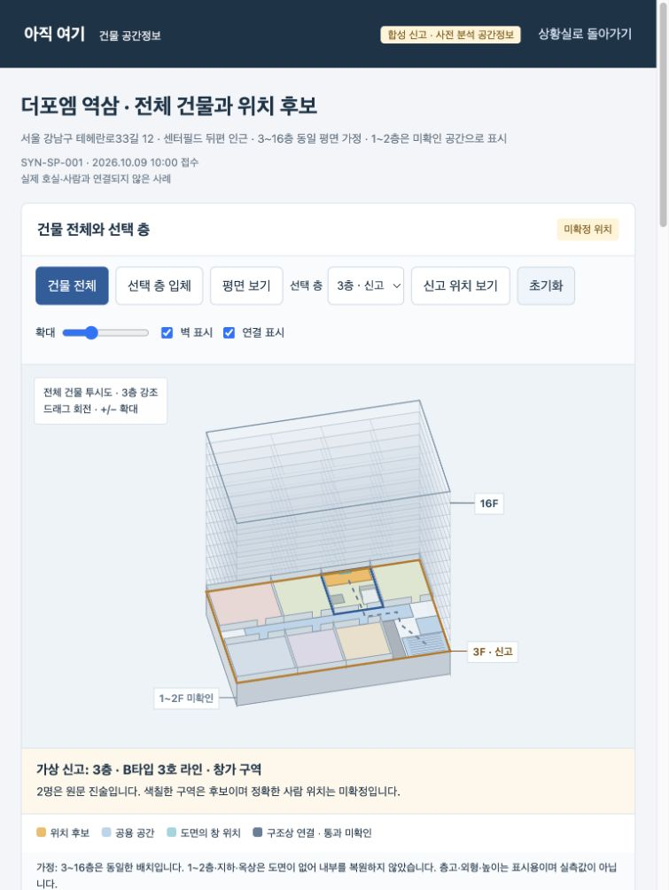

# 건물 공간정보 목업 검증

2026-10-09. 페이지: `web/spatial/index.html`. 기존 업무 데이터와 엔진 상태는 변경하지 않는다. 사용자 추가 요청으로 공간 모델·합성 신고를 공개 빌드에 포함한다. 원본 도면 JPEG는 제외하고 출처 링크로 대조한다. 아래 v1~v3 기록의 로컬 제외 정책과 브라우저 미실행은 과거 상태다. 최신 공개 통합 검증은 이 문서 하단에 기록한다.

## 구현과 입력

- 더포엠 역삼 공개 소개 자료의 3~16층 평면도. 원본 출처·SHA256·이미지 생성 프롬프트는 `web/spatial/assets/provenance.json`.
- 실제 gpt-6.1-sol 작업자가 도면·합성 사진·문자를 읽고 정답을 받지 않은 채 구조와 후보를 기록했다. 원출력은 `assets/floor-model.json`, `assets/analysis.json`. 표시용 이미지 좌표이며 실측 CAD·지리 좌표가 아니다.
- 사용자 승인한 동일 평면 가정으로 3~16층 14개 층을 반복했다. 1~2층은 내부 없는 미확인 기단이다. 지하·옥상·실제 외형·층고는 복원하지 않았다. 반복은 새 모델 해석이 아니다.
- 전체 건물 투시도, 선택 층 입체·평면, 3~16층 선택, 신고 위치 복귀, 회전·확대·초기화, 공간 선택, 이미지 확대를 지원한다.
- 다른 층을 선택해도 가상 신고는 3층에 유지한다. 다른 층에 신고 후보를 그리지 않는다. 라인 정보가 없는 비교는 규칙 기반 목업으로 구분한다.
- 후보 설명과 2명 진술을 캔버스 밖 상태 카드로 옮겼다. 물음표 마커를 제거했다. 짧은 공간·층 라벨에는 경계 및 충돌 검사를 적용했다.

## 실제 검사

- Python 회귀: **78 tests PASS**. `python3 -B -m unittest discover -s tests -v`. 처음 샌드박스에서 포트 바인딩이 차단되었으며, 승인된 임시 루프백 테스트에서 재실행해 통과했다.
- 엔진 smoke: **28 PASS**. fixture 재생: **20/20 사례, 91/91 검사 PASS**. 모델 성능 지표로 해석하지 않는다.
- JS 문법 PASS. 메인 canvas 렌더 및 라벨 검사 **81조합 PASS**.
- 독립 QA: Node DOM/Canvas 모의 기능 **14개 PASS**, 화면 너비·층·모드·회전·확대·시점 **648조합, 4,057개 라벨의 경계/충돌 PASS**. 실제 검사한 파일 지문과 렌더 4장을 QA 기록에 보존한다.
- 자동 실제 브라우저: **NOT_RUN**. `file://` 페이지 접근이 도구의 URL 정책에서 차단되었다. 다른 브라우저·서버·CDP로 같은 동작을 우회하지 않았다. canvas 직접 렌더를 브라우저 screenshot으로 부르지 않는다.
- 독립 QA가 로컬 서버 CSP의 inline JS/CSS 차단을 발견했다. 정책을 완화하지 않고 `app.js`·`style.css` 외부 파일과 명시한 경로 allowlist로 수정했다. HTML의 style 속성도 제거했다.
- 공개 빌드에서 공간 페이지·메뉴가 제외되는 것을 확인했다. 실제 외부 게시·출동·새 실시간 모델 호출 없음.

## 반복 검사와 한계

`python3 -B scripts/build_spatial.py`는 보존된 모델 JSON을 페이지에 다시 넣는다. 모델 호출은 하지 않는다. 실시간 신고 인식, 현장 도면 최신성, 인원 상태, 통과 안전, 실제 구조 효과는 검증하지 않았다.

실제 브라우저에서 문서 전체 배치·스크롤·장치별 동작은 사용자가 열린 페이지를 새로고침해 확인할 수 있다. Node 모의 검사와 canvas 렌더는 CSS 전체 레이아웃을 증명하지 않는다.

실행 장부: `spatial-v1`(원본 실제 Sol 해석), `spatial-v2`(사용자 반복층 가정, 재검사), `spatial-v3`(CSP 수정 후 독립 QA). 기존 도면 분석을 보존했다. 지문 재검사에서 단순 파일 SHA256과 하네스의 `file\0` 접두어 지문을 비교한 최초 실패 기록은 보존하고 공식 함수로 정정했다.

## 기존 페이지 영향 확인

새 HTML 페이지는 `web/spatial/index.html` 한 개다. JS·CSS·모델 JSON·이미지 자산은 이 페이지 전용이다. 기존 업무 JS·CSS·정적 저장 어댑터, 기존 재생 HTML/JS/CSS, seed, service/ 및 rescue/ 추적 파일은 HEAD와 비교해 변경이 없다.

기존 연동 파일은 세 개가 바뀌었다. `web/index.html`에 로컬 메뉴 링크 한 개, `scripts/serve.py`에 공간 페이지/JS/CSS/이미지 전용 경로 여섯 개, `scripts/build_pages.py`에 로컬 메뉴를 공개 결과에서 제외하는 처리를 추가했다. 따라서 모든 기존 파일이 무변경인 것은 아니다.

새 공개 빌드의 index.html은 기존 HEAD HTML에 원래 빌드 변환을 적용한 결과와 바이트 수준으로 동일하다. 공개 출력에는 공간 페이지가 없다. `isolation-check.json`으로 기록했으며 기존78회귀·독립23검사·실행장부 검증을 통과했다. 실제 브라우저 화면 및 전체 CSS 배치는 미검증이다.

## v3 공개 서비스 통합 검증 — 2026-10-09

사용자 추가 요청에 따라 공개 메뉴와 /spatial/을 포함한다. 공개 빌더는 공간 UI·모델·분석·합성 신고·provenance 8파일만 복사하고 해시를 기록한다. 원본 도면 JPEG는 복사하지 않으며 출처 사이트 anchor 링크로 대조한다. 보존된 모델 JSON의 원본 파일명은 과거 입력 메타데이터이며 실행되는 이미지 요청이 아니다. 원본 JSON·합성 사진·후보·규칙 기반 반사실 비교를 변경하지 않았다.

메인이 127.0.0.1:8769/spatial/ 실제 브라우저에서 16층 선택·평면 전환 → 신고 위치 보기로 3층 복귀 → 라인 없는 복수 후보 → 초기화 → 합성 사진 확대/닫기를 실행했다. 16층에 가상 신고가 없음을 표시하고 3층 요청을 유지했다. 실제 console error는 0개였다. 기본 뷰포트770px, 문서폭755px로 가로 넘침이 없고 표시된 버튼/선택기 높이는44px 이상이었다. 390px 뷰포트 재정의 요청이 적용되지 않아 실제390px 모바일 검사는 미실행으로 남긴다. 모의390px 검사와 구분한다.

독립 QA는 공간 전용8검사, 전체 Python101, AI API37, Codex23, 저장 어댑터21을 통과했다. 샌드박스 포트 권한 실패4개는 원로그로 보존하고 승인된 루프백 실행에서101전부 통과했다. cloud/offline의8공간자산·해시·JPEG제외·메뉴·llms/sitemap·원형JSON·20합성보고 보존을 확인했다. 1000/390px DOM/Canvas 모의 조작은 실제 모바일 브라우저 검사와 구분한다. 실제 공개 배포는 최종 통합 이후 별도 기록한다. 공간 페이지를 열어 새 모델 호출 또는 Supabase 사건 갱신을 수행하지 않는다.
